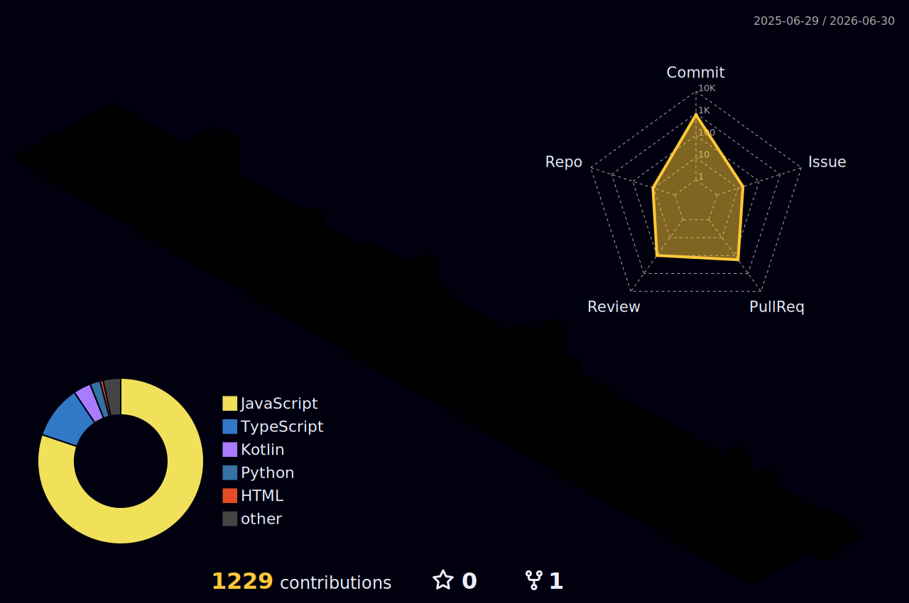

## 👋 About Me

안녕하세요, 프론트엔드 개발자 **조민서**입니다.  
사용자 경험을 고려한 UI와 안정적인 웹 서비스를 만드는 것에 관심이 있습니다.

 

## 🛠 Tech Stack

  
  
  
  

 

## 🌱 Activity

| Activity | Period |
| --- | --- |
| 영남대학교 멋쟁이사자처럼 13기 FE | 2025.03.01 ~ 2025.12.31 |
| 영남대학교 멋쟁이사자처럼 14기 운영진 - FE | 2026.01.01 ~ |

 

## 📊 GitHub Contributions

 

## 🐾 GitAnimals

 

